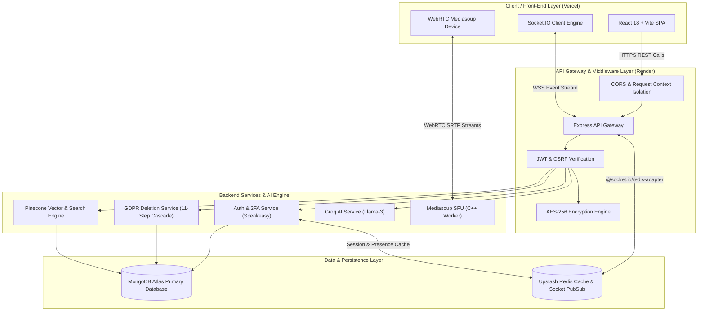

# Pulse-Platform ⚡ — Enterprise High-Throughput Real-Time Collaboration, AI & Media System

[](https://private-pulse-platform.vercel.app)
[](https://private-pulse-platform-backend.onrender.com)
[](https://mediasoup.org)
[](https://socket.io)
[](https://pinecone.io)
[](https://groq.com)
[](#5-security-privacy--compliance-governance)

> 🌐 **Live Application Environments:**
> - **Frontend Web Application (Vercel):** [https://private-pulse-platform.vercel.app](https://private-pulse-platform.vercel.app)
> - **Backend API Service (Render):** [https://private-pulse-platform-backend.onrender.com](https://private-pulse-platform-backend.onrender.com)

---

## 1. Executive Summary & Core Platform Capabilities

**Pulse-Platform** is an enterprise-grade, high-throughput real-time collaboration ecosystem engineered for distributed teams. It combines zero-latency WebSocket signaling, Mediasoup Selective Forwarding Unit (SFU) audio/video calling, AI-assisted smart reply & search capabilities, and GDPR/SOC2 compliance standards into a single unified architecture.

### Key Capabilities:
- 💬 **Real-Time E2EE Messaging & Threading**: End-to-end encrypted messaging, unread read receipts, nested message threads, file attachments, and zero-knowledge blind search (`Ctrl+K`).
- 📹 **Mediasoup SFU WebRTC Video/Audio Calls**: Low-latency multi-party video conferencing powered by a C++ media worker forwarding RTP streams without client-side encoding amplification.
- 🔍 **Pinecone Vector & 7-Filter Advanced Search**: Vector semantic message similarity search (`/api/search/semantic`), 7-filter structural query engine (sender, dates, attachments, links, mentions), autocomplete suggestions, and search query analytics (`/api/search/analytics`).
- 🤖 **Groq AI-Powered Features**: Context-aware 3-option smart replies (`/api/ai/messages/:id/smart-replies`), conversation summarization, and tone transformation via Llama-3 models.
- 🔒 **2FA & Security Governance**: Two-factor authentication (TOTP / Speakeasy with QR codes and backup codes), exponential account lockout protection, and CSRF token middleware.
- 🛡️ **GDPR & Data Residency Governance**: Complete 11-step cascade account deletion (`DELETE /api/users/me/delete-account`), full ZIP data export (`GET /api/users/me/export`), automated message retention policies (EU/US/APAC), 30-day regional data migration, and transparent AES-256-CBC field-level data encryption at rest.

---

## 2. System Architecture Overview

Pulse-Platform uses an event-driven, microservices-oriented system architecture:



---

## 3. Key Technical & Engineering Highlights

### ⚡ Selective Forwarding Unit (SFU) vs Mesh WebRTC
Traditional Peer-to-Peer (Mesh) WebRTC requires $N \times (N-1)$ connections. In a 6-user video call, each client must encode and upload 5 separate video streams, overloading CPU and uplink bandwidth. 
Pulse-Platform integrates **Mediasoup SFU**:
- **Producers**: Each participant sends **1 video track and 1 audio track** to the C++ media worker.
- **Consumers**: The SFU forwards incoming RTP tracks selectively to all consumers without re-encoding, preserving client CPU and network bandwidth.

### 🚀 High-Performance Caching & Redis Pub/Sub
- **Distributed Socket Scaling**: Socket.IO gateway instances utilize `@socket.io/redis-adapter` over Redis Pub/Sub channels to sync state instantly across multiple cluster nodes.
- **Presence Heartbeats**: User status mappings (`HSET user:presence:<id>`) are cached in Redis with short TTLs, eliminating expensive database reads.

### 🗄️ Database Indexing & Cursor Pagination
- Compound MongoDB indices (`{ conversation: 1, createdAt: -1 }`) ensure $O(\log N)$ cursor pagination over millions of messages.
- Decoupled transient state (typing indicators, draft buffers, WebRTC transport IDs) keeps MongoDB write loads low.

---

## 4. Complete API & Service Endpoint Reference

### 🔑 Authentication & 2FA (`/api/auth`)
| Method | Endpoint | Description | Auth Required |
|---|---|---|---|
| `POST` | `/api/auth/register` | Register a new user account | No |
| `POST` | `/api/auth/login` | Authenticate user (supports 2FA challenge) | No |
| `POST` | `/api/auth/verify-2fa-login` | Verify TOTP code during 2FA login flow | No |
| `POST` | `/api/auth/2fa/setup` | Generate 2FA secret & QR code | Yes |
| `POST` | `/api/auth/2fa/verify` | Confirm and activate 2FA on account | Yes |
| `POST` | `/api/auth/2fa/disable` | Disable 2FA with password confirmation | Yes |
| `GET` | `/api/auth/me` | Retrieve current authenticated session | Yes |

### 🛡️ Compliance, Data Residency & GDPR (`/api/users` & `/api/compliance`)
| Method | Endpoint | Description | Auth Required |
|---|---|---|---|
| `DELETE` | `/api/users/me/delete-account` | Execute 11-step cascade account deletion | Yes |
| `GET` | `/api/users/me/export` | Download full GDPR ZIP data archive (JSON + CSV) | Yes |
| `GET` | `/api/compliance/residency` | Retrieve current user data region & migration status | Yes |
| `POST` | `/api/compliance/residency/migrate` | Request a 30-day regional data migration | Yes |
| `GET` | `/api/compliance/dashboard` | Admin dashboard compliance metrics | Yes |

### 🔍 Vector & Advanced Search (`/api/search`)
| Method | Endpoint | Description | Auth Required |
|---|---|---|---|
| `GET` | `/api/search/semantic` | Pinecone vector similarity search over messages | Yes |
| `GET` | `/api/search/advanced` | Multi-filter search (sender, dates, files, links, mentions) | Yes |
| `GET` | `/api/search/autocomplete` | Real-time search query & username autocompletion | Yes |
| `GET` | `/api/search/analytics` | Search term performance, zero-results, & latency metrics | Yes |

### 🤖 AI Features (`/api/ai`)
| Method | Endpoint | Description | Auth Required |
|---|---|---|---|
| `POST` | `/api/ai/messages/:messageId/smart-replies` | Generate 3 context-aware quick reply choices | Yes |
| `POST` | `/api/ai/summarize/:conversationId` | Summarize long chat conversations via Groq Llama-3 | Yes |
| `POST` | `/api/ai/compose` | Rewrite message with custom tone/style | Yes |

### 📹 WebRTC & Mediasoup (`/api/webrtc`)
| Method | Endpoint | Description | Auth Required |
|---|---|---|---|
| `POST` | `/api/webrtc/router-capabilities` | Fetch Mediasoup router RTP capabilities | Yes |
| `POST` | `/api/webrtc/transport` | Create WebRTC Producer or Consumer transport | Yes |
| `POST` | `/api/webrtc/produce` | Publish video/audio track to SFU | Yes |
| `POST` | `/api/webrtc/consume` | Consume peer video/audio stream from SFU | Yes |

---

## 5. Security, Privacy & Compliance Governance

- **AES-256 Data Encryption at Rest**: Sensitive user data fields are encrypted at rest using AES-256-CBC with dynamic initialization vectors (IVs) and Mongoose schema hooks.
- **GDPR Cascade Deletion**: Complete cascade purging across messages, files, group memberships, call logs, and notifications with an immutable compliance log entry.
- **Data Portability**: Article 20 GDPR compliant data export streaming JSON metadata and structured CSV files in a ZIP container.
- **Account Lockout Protection**: Automatically locks accounts after repeated failed login attempts to mitigate brute-force attacks.
- **CSRF Token Middleware**: Custom CSRF token generation and validation middleware protecting all state-modifying requests.
- **Context Isolation & Audit Tracing**: Requests wrapped in `AsyncLocalStorage` tagged with unique `x-request-id` headers for end-to-end tracing.

---

## 6. Technology Stack

| Component | Technology | Role |
|---|---|---|
| **Frontend Framework** | React 18, Vite, Tailwind CSS v4 | Responsive UI rendering, state management, audio/video track capture |
| **Real-Time Gateway** | Socket.IO, WebSockets, Node.js | Low-latency state sync, typing indicators, presence events |
| **WebRTC Media SFU** | Mediasoup, C++ Media Worker | High-throughput, low-latency audio/video forwarding |
| **Vector Search** | Pinecone Vector DB, OpenAI Embeddings | Semantic vector message index & similarity search |
| **AI Processing** | Groq SDK (Llama 3 models) | Context-aware smart replies, conversation summaries, tone rewrite |
| **Primary Database** | MongoDB Atlas, Mongoose ORM | Durable document storage for users, chats, calls, and compliance logs |
| **Distributed Caching** | Upstash Redis | Socket.IO cross-node adapter, presence heartbeats, search log cache |
| **Authentication** | JWT, Speakeasy (TOTP), bcryptjs | Secure session management, 2FA QR code authentication |
| **DevOps & Cloud** | Vercel (Frontend), Render (Backend Engine) | Continuous deployment, automated builds, environment isolation |

---

## 7. Local Development & Installation

### Prerequisites
- Node.js `v20.10.0` or higher
- npm `v10.0.0` or higher
- MongoDB instance (Local or Atlas)
- Redis instance (Local or Upstash)

### 1. Clone Repository & Setup Environment
```bash
git clone https://github.com/Himanshu0523/private-pulse-platform.git
cd private-pulse-platform
```

### 2. Configure Backend Environment
Create `server/.env`:
```env
PORT=5000
MONGODB_URI=mongodb://localhost:27017/pulse-chat
JWT_SECRET=your_jwt_secret_key_at_least_32_chars
ENCRYPTION_KEY=64_hex_character_key_for_aes_256
REDIS_URL=redis://localhost:6379
GROQ_API_KEY=your_groq_api_key
PINECONE_API_KEY=your_pinecone_api_key
PINECONE_INDEX_HOST=your_pinecone_index_host
```

### 3. Install Dependencies & Start Applications

**Start Backend Service:**
```bash
cd server
npm install
npm run dev
```

**Start Frontend Application:**
```bash
cd client
npm install
npm run dev
```

The frontend application will be running at `http://localhost:5173` and the backend service at `http://localhost:5000`.

---

## 📚 Architectural Documentation Suite

Explore the comprehensive sub-documentations in the repository:

- 📐 [**`docs/ARCHITECTURE.md`**](./docs/ARCHITECTURE.md) — Architectural design decisions, SFU stream forwarding flow, and component sequence diagrams.
- 📡 [**`docs/API_SPECIFICATION.md`**](./docs/API_SPECIFICATION.md) — REST API endpoint schemas, response envelopes, and Socket.IO event payloads.
- 🗄️ [**`docs/DATABASE_DESIGN.md`**](./docs/DATABASE_DESIGN.md) — Entity Relationship Diagrams (ERD), MongoDB indexing strategies, and Redis key schemas.

---

*Architected and maintained by Himanshu (`https://github.com/Himanshu0523`).*
