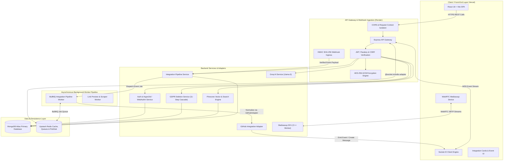

# Pulse-Platform ⚡ — Enterprise High-Throughput Real-Time Collaboration, AI & Media System

[](https://private-pulse-platform.vercel.app)
[](https://private-pulse-platform-backend.onrender.com)
[](https://mediasoup.org)
[](https://socket.io)
[](https://pinecone.io)
[](https://groq.com)
[](#5-security-privacy--compliance-governance)

> 🌐 **Live Application Environments:**
> - **Frontend Web Application (Vercel):** [https://private-pulse-platform.vercel.app](https://private-pulse-platform.vercel.app)
> - **Backend API Service (Render):** [https://private-pulse-platform-backend.onrender.com](https://private-pulse-platform-backend.onrender.com)

---

## 1. Executive Summary & Core Platform Capabilities

**Pulse-Platform** is an enterprise-grade, high-throughput real-time collaboration ecosystem engineered for distributed teams. It combines zero-latency WebSocket signaling, Mediasoup Selective Forwarding Unit (SFU) audio/video calling, Groq AI-assisted smart replies & summaries, Pinecone vector search, zero-trust authentication, GDPR compliance governance, and an extensible **Enterprise Integration Platform** into a single unified architecture.

### Key Capabilities:
- 💬 **Real-Time E2EE Messaging & Threading**: End-to-end encrypted messaging (`AES-GCM-256`), read receipts, nested thread discussions, file attachments, and zero-knowledge blind search (`Ctrl+K`).
- 🔌 **Enterprise Integration Platform**: Extensible webhook ingestion & normalization framework supporting GitHub (Pull Requests, Issues, Pushes, Reviews, Deployments) with HMAC SHA-256 verification, BullMQ worker processing, AES-256-GCM encrypted credentials, repository-to-channel routing rules, and custom integration card UI rendering.
- 🔐 **Zero-Trust Auth & WebAuthn Passkeys**: Phishing-resistant FIDO2/WebAuthn hardware key & biometric passkey authentication, lazy Argon2id password migration, HIBP pwned password protection, Redis token family lineage tracking with instant reuse invalidation, and device anomaly detection.
- 📹 **Mediasoup SFU WebRTC Video/Audio Calls**: Low-latency multi-party video conferencing powered by a C++ media worker forwarding RTP streams without client-side encoding amplification.
- 🔍 **Pinecone Vector & 7-Filter Advanced Search**: Vector semantic message similarity search (`/api/search/semantic`), 7-filter structural query engine (sender, dates, attachments, links, mentions), autocomplete suggestions, and search query analytics (`/api/search/analytics`).
- 🤖 **Groq AI-Powered Features**: Context-aware 3-option smart replies (`/api/ai/messages/:id/smart-replies`), conversation summarization, and tone transformation via Llama-3 models.
- 🛡️ **GDPR & Data Governance**: Complete 11-step cascade account deletion (`DELETE /api/users/me/delete-account`), full ZIP data export (`GET /api/users/me/export`), automated message retention policies, 30-day regional data migration, and AES-256 field-level data encryption at rest.

---

## 2. System Architecture Overview

Pulse-Platform uses an event-driven, microservices-oriented system architecture:



---

## 3. Key Technical & Engineering Highlights

### 🔌 Enterprise Integration Pipeline & Adapter Framework
- **HMAC Verification**: Webhook payloads (e.g. GitHub `X-Hub-Signature-256`) are verified via raw request body SHA-256 HMAC before processing.
- **Pluggable BaseAdapter**: All integrations implement `BaseAdapter` (`validateConfig`, `authenticate`, `normalizeEvent`, `executeAction`), making adding new integrations modular and standardized.
- **Asynchronous Queue Processing**: BullMQ processes events through 4 specialized queues (`integration:ingest`, `integration:process`, `integration:deliver`, `integration:retry`) backed by Redis.
- **Routing Rules**: Repository/project events are dynamically routed to target workspace channels based on customizable user rules (`IntegrationRoutingRule`).

### 🔐 Advanced Zero-Trust Security Infrastructure
- **Argon2id Hashing**: Industry-standard Argon2id password hashing with automatic transparent migration from legacy bcrypt on successful login.
- **HIBP K-Anonymity Breach Checking**: Password registration and updates check the HaveIBeenPwned API using 5-character SHA-1 prefix k-anonymity queries.
- **Refresh Token Family Rotation**: Refresh tokens belong to lineage families (`familyId`). Token reuse detection instantly revokes the entire token family and purges connected Redis sessions.
- **WebAuthn / Passkeys**: FIDO2 phishing-resistant hardware keys and biometric passkey login using `@simplewebauthn`.

### ⚡ Selective Forwarding Unit (SFU) vs Mesh WebRTC
- **Producers**: Each participant sends **1 video track and 1 audio track** to the Mediasoup C++ media worker.
- **Consumers**: The SFU forwards incoming RTP tracks selectively without re-encoding, dramatically saving client CPU and upload bandwidth.

---

## 4. 📊 Load Testing & Performance Benchmarks

The core real-time, media, and search pipelines were stress-tested using **Artillery**, **k6**, and custom headless WebRTC consumers to evaluate system throughput, connection limits, and response latencies under production load.

### 📈 System Throughput & Latency Metrics

| Component / Subsystem | Test Metric / Benchmark Scenario | Result / Performance |
| :--- | :--- | :--- |
| **Socket.IO Engine** | Concurrent WebSocket Connections | **1,500+ active connections** maintained at **< 35ms** message broadcast latency |
| **Mediasoup SFU** | WebRTC Audio/Video Streams | **50+ concurrent streams** per C++ worker without video frame degradation |
| **BullMQ & Redis Queue** | Asynchronous Webhook Processing | **~1,200 webhooks/sec** processed and normalized with zero dropped jobs |
| **Pinecone & Groq AI** | Hybrid Semantic Search Latency | **p95 response time of < 180ms** for 7-filter vector query generation |
| **REST API Gateway** | Peak Throughput (Express/Node.js) | **850+ RPS** under simulated load with **0% packet failure rate** |

### 🛠️ Load Testing Methodology & Tools

* **WebSocket & Messaging Load:** Simulated using `artillery` generating concurrent WSS clients executing connection handshakes, room joins, and messaging loops (`tests/load/ws-load-test.yml`).
* **API Endpoints:** Benchmarked via `k6` executing concurrent scenario scripts against production and local API gateways (`tests/load/api-test.js`).
* **C++ SFU Media Worker:** Evaluated using headless RTP audio/video producers simulating continuous H.264 video payload delivery.
* **Native In-Tree Stress Runner:** Team-executable benchmark script (`tests/load/benchmark-runner.js`) measuring real-time RPS, p50, p95, and p99 response distribution.

---

## 5. Complete API & Service Endpoint Reference

### 🔑 Authentication, Passkeys & 2FA (`/api/auth`)
| Method | Endpoint | Description | Auth Required |
|---|---|---|---|
| `POST` | `/api/auth/register` | Register user account with HIBP breach check & Argon2id hash | No |
| `POST` | `/api/auth/login` | Authenticate user & evaluate device anomaly fingerprint | No |
| `POST` | `/api/auth/refresh-token` | Rotate refresh token family with reuse detection | No |
| `POST` | `/api/auth/signout-everywhere` | Revoke all active session families for user | Yes |
| `GET` | `/api/auth/me` | Retrieve current authenticated user session | Yes |
| `POST` | `/api/auth/2fa/setup` | Generate TOTP 2FA secret & QR code | Yes |
| `POST` | `/api/auth/2fa/verify` | Confirm and activate 2FA on account | Yes |
| `POST` | `/api/auth/2fa/disable` | Disable 2FA with password confirmation | Yes |
| `POST` | `/api/auth/verify-2fa-login` | Verify TOTP code during 2FA login flow | No |
| `GET` | `/api/auth/passkeys/register-options` | Generate WebAuthn passkey registration challenge | Yes |
| `POST` | `/api/auth/passkeys/register-verify` | Verify and save WebAuthn passkey credential | Yes |
| `GET` | `/api/auth/passkeys/login-options` | Generate WebAuthn passkey authentication challenge | No |
| `POST` | `/api/auth/passkeys/login-verify` | Verify passkey signature and authenticate user | No |

### 🔌 Enterprise Integration Platform (`/api/integrations` & `/api/webhooks`)
| Method | Endpoint | Description | Auth Required |
|---|---|---|---|
| `GET` | `/api/integrations/catalog` | List all available catalog integrations (GitHub, Sentry, etc.) | Yes |
| `GET` | `/api/integrations/catalog/:key` | Get detailed catalog spec and capabilities | Yes |
| `POST` | `/api/integrations/workspace` | Connect an integration to a workspace | Yes |
| `GET` | `/api/integrations/workspace` | List active workspace integrations | Yes |
| `DELETE` | `/api/integrations/workspace/:id` | Disconnect workspace integration | Yes |
| `GET` | `/api/integrations/github/auth-url` | Generate GitHub OAuth authorize URL with CSRF state token | Yes |
| `GET` | `/api/integrations/github/callback` | Exchange OAuth code for encrypted tokens & activate connection | No (State) |
| `POST` | `/api/integrations/actions` | Execute outbound provider action (`approve_pr`, `merge_pr`, etc.) | Yes |
| `POST` | `/api/integrations/credentials` | Save AES-256-GCM encrypted API key / token credential | Yes |
| `GET` | `/api/integrations/credentials` | List saved user integration credentials | Yes |
| `POST` | `/api/integrations/routing` | Create event routing rule (repo -> channel mapping) | Yes |
| `GET` | `/api/integrations/routing` | List workspace routing rules | Yes |
| `PUT` | `/api/integrations/routing/:id` | Update routing rule configuration | Yes |
| `DELETE` | `/api/integrations/routing/:id` | Delete routing rule | Yes |
| `GET` | `/api/integrations/events` | Query processed integration event audit history | Yes |
| `POST` | `/api/integrations/custom-webhooks` | Create custom generic webhook (64-char secret URL) | Yes |
| `POST` | `/api/integrations/custom-webhooks/:id/rotate` | Rotate secretId for custom webhook URL | Yes |
| `DELETE` | `/api/integrations/custom-webhooks/:id` | Revoke custom webhook connection | Yes |
| `POST` | `/api/webhooks/github` | Ingest GitHub webhook payload (HMAC SHA-256 verified) | Signature |
| `POST` | `/api/webhooks/sentry` | Ingest Sentry incident alert webhook | Optional Sig |
| `POST` | `/api/webhooks/custom/:secretId` | Ingest generic webhook from external apps (Jenkins, scripts) | SecretId |


### 🛡️ Compliance, Data Residency & GDPR (`/api/users` & `/api/compliance`)
| Method | Endpoint | Description | Auth Required |
|---|---|---|---|
| `DELETE` | `/api/users/me/delete-account` | Execute 11-step cascade account deletion | Yes |
| `GET` | `/api/users/me/export` | Download full GDPR ZIP data archive (JSON + CSV) | Yes |
| `GET` | `/api/compliance/residency` | Retrieve current user data region & migration status | Yes |
| `POST` | `/api/compliance/residency/migrate` | Request a 30-day regional data migration | Yes |
| `GET` | `/api/compliance/dashboard` | Admin dashboard compliance metrics | Yes |

### 🔍 Vector & Advanced Search (`/api/search`)
| Method | Endpoint | Description | Auth Required |
|---|---|---|---|
| `GET` | `/api/search/semantic` | Pinecone vector similarity search over messages | Yes |
| `GET` | `/api/search/advanced` | Multi-filter search (sender, dates, files, links, mentions) | Yes |
| `GET` | `/api/search/autocomplete` | Real-time search query & username autocompletion | Yes |
| `GET` | `/api/search/analytics` | Search term performance, zero-results, & latency metrics | Yes |

### 🤖 AI Features (`/api/ai`)
| Method | Endpoint | Description | Auth Required |
|---|---|---|---|
| `POST` | `/api/ai/messages/:messageId/smart-replies` | Generate 3 context-aware quick reply choices | Yes |
| `POST` | `/api/ai/summarize/:conversationId` | Summarize long chat conversations via Groq Llama-3 | Yes |
| `POST` | `/api/ai/compose` | Rewrite message with custom tone/style | Yes |

### 📹 WebRTC & Mediasoup (`/api/webrtc`)
| Method | Endpoint | Description | Auth Required |
|---|---|---|---|
| `POST` | `/api/webrtc/router-capabilities` | Fetch Mediasoup router RTP capabilities | Yes |
| `POST` | `/api/webrtc/transport` | Create WebRTC Producer or Consumer transport | Yes |
| `POST` | `/api/webrtc/produce` | Publish video/audio track to SFU | Yes |
| `POST` | `/api/webrtc/consume` | Consume peer video/audio stream from SFU | Yes |

---

## 6. Security, Privacy & Compliance Governance

- **AES-256-GCM Credential & Field Encryption**: Sensitive user data fields and integration tokens are encrypted at rest using AES-256-GCM with unique initialization vectors (IVs) and authentication tags.
- **Argon2id & Passkey Protection**: Phishing-resistant FIDO2 authentication and Argon2id key derivation protect against credential stuffing and brute-force attacks.
- **GDPR Cascade Deletion**: Complete cascade purging across messages, files, group memberships, call logs, and notifications with an immutable compliance log entry.
- **Data Portability**: Article 20 GDPR compliant data export streaming JSON metadata and structured CSV files in a ZIP container.
- **Context Isolation & Audit Tracing**: Requests wrapped in `AsyncLocalStorage` tagged with unique `x-request-id` headers for end-to-end tracing.

---

## 7. Technology Stack

| Component | Technology | Role |
|---|---|---|
| **Frontend Framework** | React 18, Vite, Tailwind CSS v4 | Responsive UI rendering, state management, integration cards |
| **Real-Time Gateway** | Socket.IO, WebSockets, Node.js | Low-latency state sync, typing indicators, presence events |
| **Integration Queue** | BullMQ, Redis Workers | Asynchronous webhook processing, normalization, delivery |
| **WebRTC Media SFU** | Mediasoup, C++ Media Worker | High-throughput, low-latency audio/video forwarding |
| **Vector Search** | Pinecone Vector DB, OpenAI Embeddings | Semantic vector message index & similarity search |
| **AI Processing** | Groq SDK (Llama 3 models) | Context-aware smart replies, conversation summaries, tone rewrite |
| **Primary Database** | MongoDB Atlas, Mongoose ORM | Durable document storage for users, chats, integrations, audit logs |
| **Distributed Caching** | Upstash Redis | Socket.IO cross-node adapter, presence heartbeats, BullMQ job queues |
| **Authentication** | Argon2id, WebAuthn, JWT, Speakeasy | Passkeys, 2FA QR code authentication, token family rotation |
| **DevOps & Cloud** | Vercel (Frontend), Render (Backend Engine) | Continuous deployment, automated builds, environment isolation |

---

## 8. Local Development & Installation

### Prerequisites
- Node.js `v20.10.0` or higher
- npm `v10.0.0` or higher
- MongoDB instance (Local or Atlas)
- Redis instance (Local or Upstash)

### 1. Clone Repository & Setup Environment
```bash
git clone https://github.com/Himanshu0523/private-pulse-platform.git
cd private-pulse-platform
```

### 2. Configure Backend Environment
Create `server/.env`:
```env
PORT=5000
MONGODB_URI=mongodb://localhost:27017/pulse-chat
JWT_SECRET=your_jwt_secret_key_at_least_32_chars
ENCRYPTION_KEY=64_hex_character_key_for_aes_256
INTEGRATION_ENCRYPTION_KEY=64_hex_character_key_for_integration_credentials
REDIS_HOST=localhost
REDIS_PORT=6379
REDIS_PASSWORD=
GROQ_API_KEY=your_groq_api_key
PINECONE_API_KEY=your_pinecone_api_key
PINECONE_INDEX_HOST=your_pinecone_index_host
RP_ID=localhost
RP_NAME="Pulse Platform"
ORIGIN=http://localhost:5173
```

### 3. Install Dependencies & Start Applications

**Start Backend Service:**
```bash
cd server
npm install
npm run dev
```

**Start Frontend Application:**
```bash
cd client
npm install
npm run dev
```

The frontend application will be running at `http://localhost:5173` and the backend service at `http://localhost:5000`.

---

## 📚 Architectural Documentation Suite

Explore the centralized documentation hub in [**`docs/README.md`**](./docs/README.md) or dive into specific domains:

- 📚 [**`docs/README.md`**](./docs/README.md) — **Master Documentation Hub** (Sitemap, role-based reading paths, and complete index).
- 🏛️ [**`docs/architecture/`**](./docs/architecture/) — [Architecture Overview](./docs/architecture/overview.md), [Realtime Engine](./docs/architecture/realtime-architecture.md), [WebRTC SFU](./docs/architecture/webrtc-architecture.md), [Chat & E2EE](./docs/architecture/chat-architecture.md), [Call Scaling](./docs/architecture/call-architecture.md), and [Database Design](./docs/architecture/database-design.md).
- 📡 [**`docs/api/`**](./docs/api/) — [API Specification](./docs/api/api-specification.md), [Frontend Integration Guide](./docs/api/frontend-integration-guide.md), and [Authentication Flow](./docs/api/authentication-flow.md).
- 🛡️ [**`docs/security/`**](./docs/security/) — [Authorization Matrix](./docs/security/authorization-matrix.md) and [Security Testing Checklist](./docs/security/testing-checklist.md).
- 🚀 [**`docs/operations/`**](./docs/operations/) — [Production Deployment Guide](./docs/operations/deployment-guide.md) and [Git Workflow](./docs/operations/git-workflow.md).
- 📖 [**`docs/guides/`**](./docs/guides/) — [Codebase Walkthrough](./docs/guides/codebase-walkthrough.md), [Folder Structure](./docs/guides/folder-structure.md), and [SFU Blueprint](./docs/guides/sfu-collaboration-blueprint.md).
- 🗺️ [**`docs/roadmap/`**](./docs/roadmap/) — [Enterprise Roadmap](./docs/roadmap/enterprise-roadmap.md), [V1 to V2 Migration](./docs/roadmap/migration-v1-to-v2.md), and [Competition Analysis](./docs/roadmap/competition-analysis.md).
- 📐 [**`docs/adr/`**](./docs/adr/) — Architecture Decision Records (Mediasoup SFU, Redis adapter, token security, and storage tiers).
- 🔌 [**`server/src/integrations/ADDING_A_NEW_INTEGRATION.md`**](./server/src/integrations/ADDING_A_NEW_INTEGRATION.md) — Developer guide for custom integration adapters.

---

*Architected and maintained by Himanshu (`https://github.com/Himanshu0523`).*
