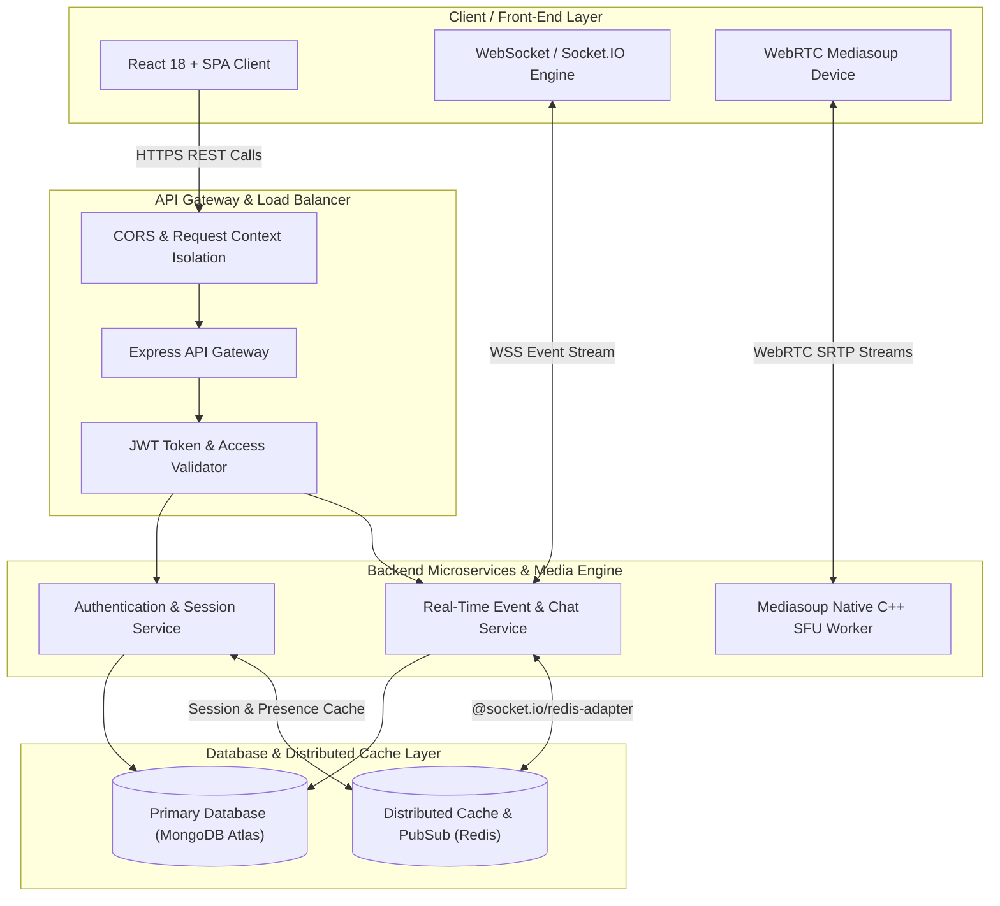

# Pulse-Platform ⚡ — High-Throughput Real-Time Collaboration & Media System Architecture

> 🌐 **Live Deployments:**
> - **Frontend Application (Vercel):** [https://private-pulse-platform.vercel.app](https://private-pulse-platform.vercel.app)

> 🔒 **Security Notice:** *The source code for the frontend and backend services is maintained in private, production repositories to satisfy security standards, proprietary protections, and environment compliance. This repository serves as a high-level system design showcase and architectural blueprint for technical evaluation.*

---

## 1. Project Title & Executive Summary

**Pulse-Platform** is an enterprise-grade, high-throughput real-time collaboration ecosystem designed to solve sub-100ms video/audio latency and state synchronization bottlenecks in distributed applications.

By decoupling real-time WebSockets signaling from high-bandwidth WebRTC RTP media streams, Pulse-Platform eliminates the high CPU and uplink bandwidth overhead typical of traditional Peer-to-Peer mesh video architectures. It offers an end-to-end framework capable of supporting real-time E2EE messaging, multi-party SFU video conferences, collaborative canvas whiteboarding, and distributed workspace presence.

---

## 2. System Architecture Overview

The system utilizes an decoupled, event-driven microservices architecture:

1. **Client Tier**: A responsive SPA built with React 18 and Vite, consuming low-latency media streams via `mediasoup-client` and real-time state events via `socket.io-client`.
2. **API Gateway & Middleware Layer**: Express-based gateway handling context isolation (`AsyncLocalStorage`), CORS preflight filtering, rate limiting, request tracing (`x-request-id`), and JWT access token verification.
3. **Real-Time Gateway & WebRTC SFU**:
   - **Socket.IO Real-Time Gateway**: Manages state broadcast channels, presence heartbeats, and room scoping.
   - **Mediasoup SFU Worker**: A native C++ Selective Forwarding Unit that handles DTLS/SRTP media transport negotiation and routes incoming video/audio tracks directly to connected peers without CPU-intensive re-encoding.
4. **Persistence & Distributed Cache Layer**: MongoDB Atlas for durable document storage paired with an Upstash Redis cluster for cross-node Socket.IO event broadcasting and presence session caching.

---

## 3. System Architecture Diagram

---

## 4. Key Technical & Design Highlights

### ⚡ Real-Time Communication & WebRTC SFU Architecture
- **SFU vs. Mesh Topology**: Traditional Peer-to-Peer WebRTC requires $N \times (N-1)$ connections, requiring client devices to encode and transmit multiple video streams simultaneously. Pulse-Platform utilizes **Mediasoup SFU** where each client uploads **1 video and 1 audio track** to the SFU server, which then routes tracks selectively to consumers with negligible CPU impact.
- **Socket.IO Horizontal Scaling**: Gateway nodes utilize `@socket.io/redis-adapter` over Redis Pub/Sub channels. When a user sends a message on Node A, the payload is published to Redis and delivered instantly to room participants connected to Node B or Node C.

### 🚀 Caching & Performance Optimization with Redis
- **Presence Heartbeats**: User online/away/offline states are stored in Redis (`HSET user:presence:<id>`) with short TTLs, preventing expensive database reads when displaying member lists in high-concurrency rooms.
- **Anti-Flicker UX (200ms Rule)**: The frontend component design incorporates a 200ms delay timer rule to prevent distracting UI spinners from flashing during sub-200ms API responses.

### 🗄️ Data Consistency & Database Indexing
- **Message Pagination**: Optimized MongoDB compound indices (`{ conversationId: 1, createdAt: -1 }`) ensure $O(\log N)$ cursor pagination across millions of stored messages.
- **State Decoupling**: Ephemeral state (typing indicators, presence, WebRTC transport IDs) is decoupled from persistent MongoDB collections and managed in memory.

---

## 5. Security & Privacy Considerations

- **Token-Based Authentication**: Short-lived JWT access tokens accompanied by HTTP-only refresh cookies for secure session management.
- **Context Isolation & Request Tracing**: Every request is wrapped in an `AsyncLocalStorage` request context tagged with a unique `x-request-id` header for request lifecycle auditing.
- **Strict CORS Policies**: Preflight `OPTIONS` requests are handled at the root of the middleware pipeline to isolate trusted origins (`https://private-pulse-platform.vercel.app`).
- **Environment & Input Isolation**: Strict schema validation using Joi/Zod models and parameterized database queries to prevent injection vulnerabilities.
- **Repository Security Disclaimer**: *All source code is maintained in secure private production repositories to comply with security standards and proprietary protections.*

---

## 6. Technology Stack Table

| Layer | Technologies Used | Key Responsibilities |
|---|---|---|
| **Client UI** | React 18, Vite, Tailwind CSS v4, Lucide Icons | Responsive UI rendering, state management, audio/video track capture |
| **Media Stream Engine** | Mediasoup Client, WebRTC, SRTP/DTLS | High-performance sub-100ms real-time audio & video forwarding |
| **Real-Time Gateway** | Socket.IO, WebSockets, Node.js | Bidirectional event transport, chat messaging, presence synchronization |
| **API Gateway** | Express.js, AsyncLocalStorage, CORS, Helmet | Route dispatching, token authorization, request context isolation |
| **Primary Database** | MongoDB Atlas (Mongoose ORM) | Durable document storage for user credentials, rooms, and chat logs |
| **Caching & Pub/Sub** | Upstash Redis | Socket.IO cross-node adapter, presence heartbeat cache, session mapping |
| **DevOps & Cloud** | Vercel Edge (Frontend), Render (Backend Engine) | Continuous deployment, automated builds, environment isolation |

---

## 📚 Architectural Documentation Suite

Detailed architectural sub-specifications can be explored in the [`docs/`](./docs) directory:

- 📐 [**`docs/ARCHITECTURE.md`**](./docs/ARCHITECTURE.md) — Comprehensive technical blueprint, layer breakdowns, and WebRTC sequence diagrams.
- 📡 [**`docs/API_SPECIFICATION.md`**](./docs/API_SPECIFICATION.md) — REST API endpoint matrices, envelope formats, and Socket.IO event contracts.
- 🗄️ [**`docs/DATABASE_DESIGN.md`**](./docs/DATABASE_DESIGN.md) — Entity-Relationship Diagrams (ERD), MongoDB indexing strategies, and Redis caching topologies.

---

*Architected and maintained by Himanshu (`https://github.com/Himanshu0523`).*