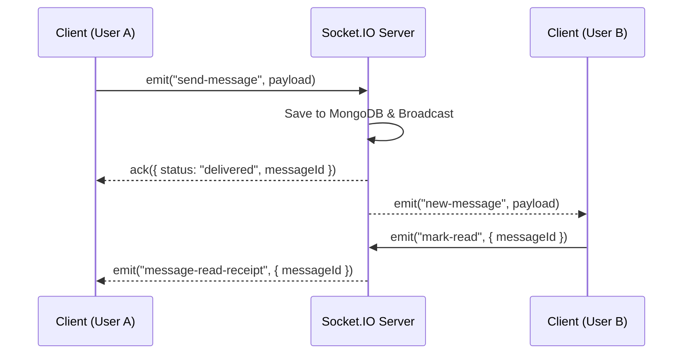

# Private Pulse Platform — API & Real-Time Event Specification

This specification documents the RESTful API standards, request context protocols, and real-time Socket.IO event interfaces powering the **Private Pulse Platform**.

---

## 1. REST API Endpoint Overview

### Base URL
- **Production**: `https://private-pulse-platform-backend.onrender.com/api`
- **Development**: `http://localhost:5000/api`

### Standard Response Envelope
All API endpoints return JSON conforming to a standardized envelope format:

```json
{
  "success": true,
  "data": { ... },
  "message": "Operation completed successfully",
  "meta": {
    "requestId": "req_8f9a2b1c4d",
    "timestamp": "2026-08-11T11:00:00Z"
  }
}
```

---

## 2. API Endpoint Matrix

### 🔑 Authentication (`/api/auth`)
| Method | Endpoint | Description | Auth Required |
|---|---|---|---|
| `POST` | `/api/auth/register` | Register a new user account | No |
| `POST` | `/api/auth/login` | Authenticate user & issue access tokens | No |
| `POST` | `/api/auth/logout` | Revoke session & clear refresh cookies | Yes |
| `GET` | `/api/auth/me` | Fetch active authenticated user session | Yes |

### 💬 Messaging & Threads (`/api/messages`)
| Method | Endpoint | Description | Auth Required |
|---|---|---|---|
| `GET` | `/api/conversations` | Retrieve all active direct & group chats | Yes |
| `GET` | `/api/messages/:conversationId` | Paginated message fetch for a room | Yes |
| `POST` | `/api/messages` | Send an encrypted chat message | Yes |
| `GET` | `/api/messages/:messageId/thread` | Fetch nested thread replies for a message | Yes |

### 📹 WebRTC & Media (`/api/webrtc`)
| Method | Endpoint | Description | Auth Required |
|---|---|---|---|
| `POST` | `/api/webrtc/router-capabilities` | Fetch MediaSoup Router RTP Capabilities | Yes |
| `POST` | `/api/webrtc/transport` | Create WebRtcTransport (Producer or Consumer) | Yes |
| `POST` | `/api/webrtc/produce` | Connect track producer to SFU worker | Yes |
| `POST` | `/api/webrtc/consume` | Connect track consumer for peer stream | Yes |

---

## 3. Real-Time Socket.IO Protocol Specification

### Connection Handshake
Clients must provide a valid JWT access token upon connection:
```javascript
const socket = io("https://private-pulse-platform-backend.onrender.com", {
  auth: { token: "Bearer <access_token>" },
  transports: ["websocket", "polling"]
});
```

### Event Contracts Matrix



#### Outgoing Events (Client $\rightarrow$ Server)
- `join-room`: Join room scope (`{ roomId }`).
- `send-message`: Transmit real-time message payload.
- `typing-start`: Broadcast typing state indicator.
- `typing-stop`: Clear typing state indicator.
- `whiteboard-draw`: Broadcast canvas drawing path data.

#### Incoming Events (Server $\rightarrow$ Client)
- `new-message`: Receive real-time message in active room.
- `user-presence-change`: Online/offline/away status updates.
- `call-incoming`: Receive audio/video call invitation.
- `transcript-updated`: AI real-time call transcription stream update.
