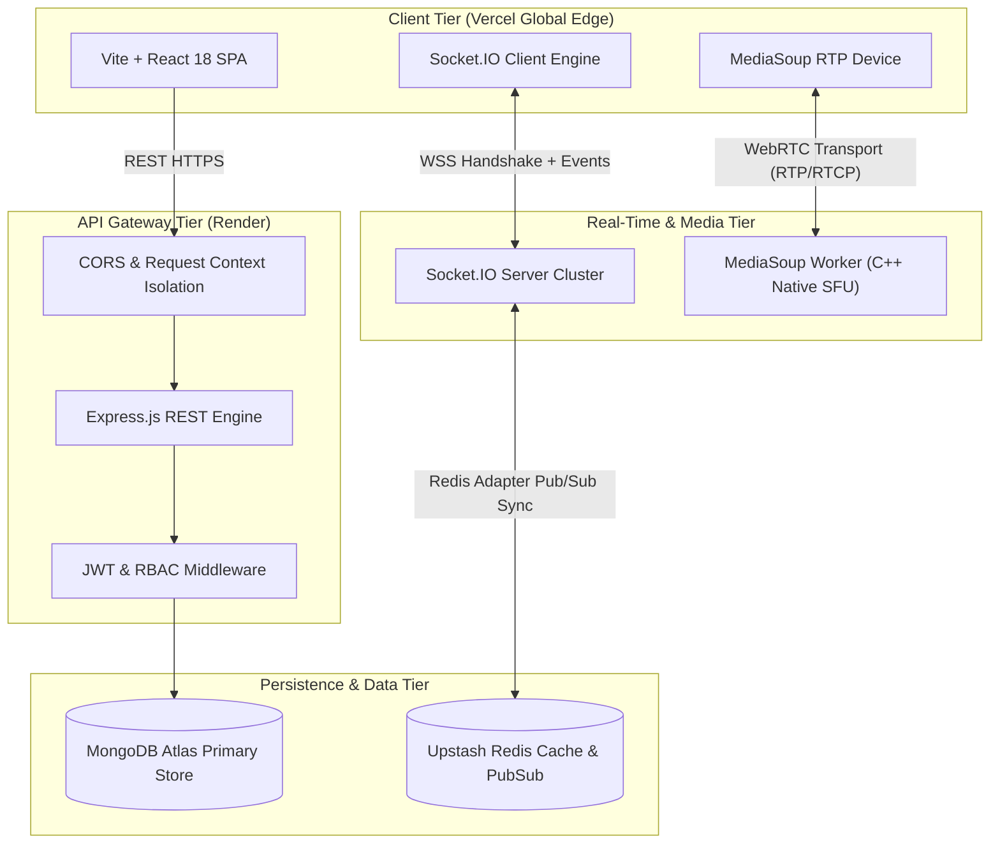
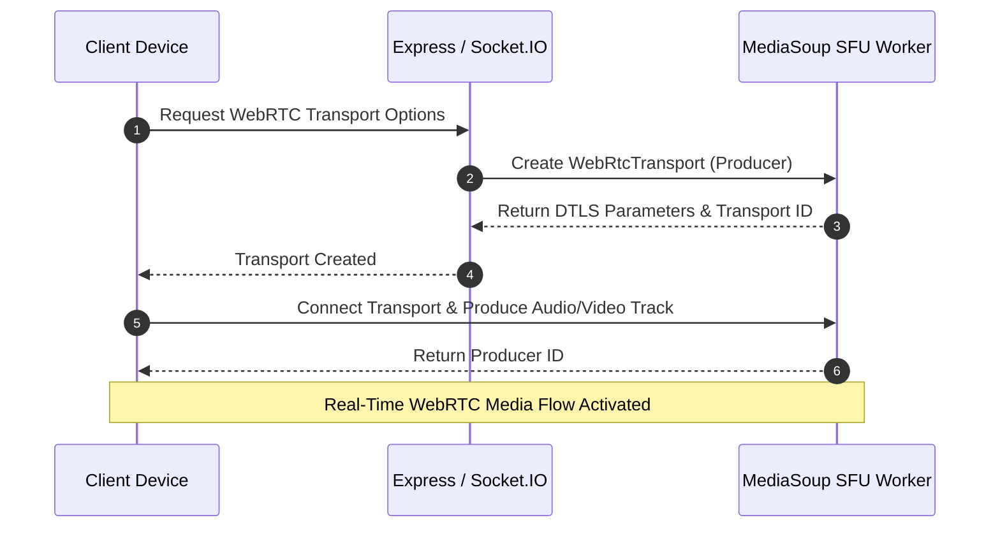
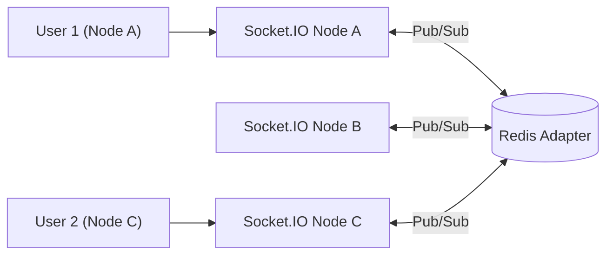

# Private Pulse Platform — Deep Dive System Architecture

This document provides a technical analysis of the system architecture, design decisions, and engineering trade-offs made in the building of **Private Pulse Platform**.

---

## 1. System Overview & Core Objectives

Private Pulse Platform is designed as an ultra-low latency, scalable real-time collaboration ecosystem. The primary design goals are:
- **Sub-100ms Media Latency**: Utilizing Selective Forwarding Units (SFU) via MediaSoup instead of Mesh topologies for group video.
- **Horizontal Gateway Scalability**: Socket.IO instances backed by Redis Pub/Sub adapters.
- **Resilient Security**: End-to-end encryption principles for sensitive data, JWT rotation, and context-isolated request pipelines.

---

## 2. End-to-End System Architecture

---

## 3. WebRTC Media Architecture: Mesh vs. SFU Trade-off

### The Challenge
Pure Peer-to-Peer (Mesh) WebRTC requires $N \times (N-1)$ connections. In a group call with 6 participants, each client must encode and transmit 5 video streams, saturating client uplink bandwidth and CPU.

### The Solution: Selective Forwarding Unit (MediaSoup)
We implemented **MediaSoup SFU** at the server layer:
- **Producers**: Each client sends exactly **1 video stream** and **1 audio stream** to the SFU worker.
- **Consumers**: The SFU forwards incoming RTP streams to all other connected participants without re-encoding, reducing CPU overhead to near zero.

---

## 4. Real-Time Gateway & Scaling Strategy

By leveraging `@socket.io/redis-adapter`:
- State is decoupled from single Node.js processes.
- Messages sent in `user:{userId}` or `room:{roomId}` on Node A broadcast across Redis and deliver instantly to User 2 connected to Node C.

---

## 5. Security & Engineering Best Practices

1. **Anti-Flicker UX & Micro-Animations**: Loading indicators utilize a **200ms anti-flicker delay rule** and Conic Gradient rendering with full ARIA screen reader compliance.
2. **Context Isolation**: Every HTTP request is tagged with a unique `x-request-id` tracked using Node's `AsyncLocalStorage` for distributed log correlation.
3. **CORS Hygiene**: Strict preflight handling for production domains (`https://private-pulse-platform.vercel.app`) positioned at the root of the middleware pipeline.
