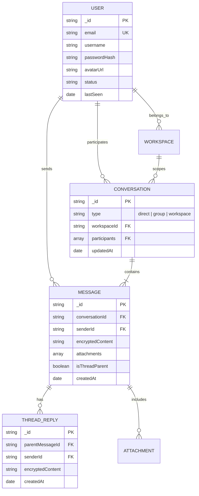

# Private Pulse Platform — Database Design & Data Modeling

This document outlines the data architecture, entity relationships, indexing strategies, and caching models implemented in **Private Pulse Platform**.

---

## 1. High-Level Entity-Relationship Concept (ERD)



---

## 2. Key Collection Schema Patterns

### `users` Collection
- `email` (indexed, unique): Account authentication identifier.
- `username` (indexed): Display handle.
- `status`: Online presence state (`'online'`, `'away'`, `'offline'`).
- `keys`: Public encryption keys for E2EE payload exchange.

### `messages` Collection
- **Compound Index**: `{ conversationId: 1, createdAt: -1 }` (Optimized for instant reverse-chronological message paging).
- `encryptedContent`: AES-256 / E2E cipher text string.
- `attachments`: File metadata references stored in static vault.

---

## 3. Caching & Memory Layer (Redis Topology)

```
┌─────────────────────────────────────────────────────────────┐
│                    Upstash Redis Cluster                    │
├──────────────────────────────┬──────────────────────────────┤
│      Presence Caching        │      Socket.IO Adapter       │
│                              │                              │
│  Key: user:presence:{id}     │  Pub/Sub Channel: socket.io  │
│  TTL: 60s (heartbeat check)  │  Cross-node event sync       │
└──────────────────────────────┴──────────────────────────────┘
```

1. **User Online Status Cache**:
   - `HSET user:presence:<userId> status "online" timestamp <epoch>`
   - Prevents database read saturation when 100s of users view active member lists.

2. **Socket Session Mapping**:
   - Map active `socket.id` $\leftrightarrow$ `userId` for quick targeted event dispatches.

---

## 4. Database Performance & Indexing Strategy

- **`messages`**: `{ conversationId: 1, createdAt: -1 }`
- **`conversations`**: `{ participants: 1, updatedAt: -1 }`
- **`users`**: `{ email: 1 }` (Unique), `{ username: 1 }`
