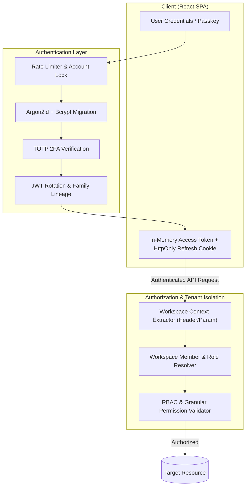

# 🔐 Authentication & Authorization Architecture Specification (Phase 3)

This document specifies the security protocols, session lifecycles, Role-Based Access Control (RBAC) hierarchy, and multi-tenant isolation guarantees implemented across **Pulse Platform**.

---

## 🏗️ Authentication Pipeline Overview



---

## 📝 Step 3.1 — Registration Protocol

```
POST /api/auth/register
   ↓
Rate limit by IP (registerLimiter)
   ↓
Validate email + password (min 6-8 chars) + HaveIBeenPwned breach check
   ↓
Hash with Argon2id (pre-save hook with transparent algo tagging)
   ↓
Create user: isEmailVerified = false
   ↓
Issue tokens (immediate basic access via JWT + HttpOnly Cookie)
   ↓
Send verification email (Resend HTTP API / SMTP Relay)
   ↓
[Sensitive actions gated by requireVerifiedEmail]
```

1. **Request Intake**: `POST /api/auth/register` with `email`, `password`, `displayName`.
2. **Schema & Strength Validation**:
   - Email format & normalization (lowercase, trimmed).
   - Password validation: Minimum 6-8 characters.
   - **HaveIBeenPwned API check**: Optional leak check (`ENABLE_PWNED_CHECK=true`) with fail-open resilience.
3. **Password Hashing**: Uses `argon2id` (or configurable bcrypt with salt factor 10).
4. **User Document Creation & Verification**:
   - User document is initialized with `isEmailVerified: false`.
   - Dispatches a 6-hour cryptographic token via Resend HTTP API or Nodemailer SMTP.
5. **Instant Token Issuance**:
   - Issues short-lived Access Token & sets HttpOnly Refresh Cookie so the user gains immediate baseline app access without friction.
   - Gated/sensitive capabilities require email verification.
6. **Audit Trail**: Generates `REGISTER_SUCCESS` or `REGISTER_FAILED` audit log in the compliance ledger.

---

## 🔑 Step 3.2 — Login Protocol & 2FA

```
POST /api/auth/login
   ↓
Rate limit by IP + email combo (exponential backoff & Redis lockout)
   ↓
Verify password hash (generic error either way to prevent user enumeration)
   ↓
If 2FA enabled → issue tempToken (5 min, rate-limited verify, single-use)
   ↓
Issue access token (15m) + refresh token (7d, rotating, absolute 30d ceiling)
   ↓
Log device/session, inspect anomaly detection & notify on new device
```

1. **Brute Force Defense (`accountLock.js`)**: Tracks consecutive failed login attempts in Redis (`login:attempts:${email}`). 5 failures trigger a 15-minute temporary lockout (`429 Too Many Requests`) with automated lockout alert emails.
2. **Credential Verification**:
   - Compares plaintext password against Argon2id / Bcrypt hash.
   - **Transparent Lazy Migration**: Automatically migrates legacy bcrypt hashes to Argon2id upon valid login.
3. **Email Verification Handling**:
   - If `REQUIRE_EMAIL_VERIFICATION=true` and unverified: Returns `403 EMAIL_NOT_VERIFIED`.
   - In standard mode: Auto-verifies unverified legacy accounts upon successful password verification.
4. **Two-Factor Authentication (TOTP)**:
   - If enabled: Returns `{ requires2FA: true, tempToken }` (5-minute expiring challenge).
   - Verified via `POST /api/auth/2fa/verify-login` with 6-digit TOTP or 8-digit emergency backup code.
5. **Token Issuance**: Issues short-lived Access Token (15m) and sets long-lived Refresh Token in `HttpOnly`, `SameSite=None` (production) / `SameSite=Strict` (development), `Secure` cookie.
6. **Device Intelligence**: Evaluates device fingerprint against known device list and triggers new device security notifications.

---

## 🔄 Step 3.3 — Password Recovery Protocol

1. **Forgot Password (`POST /api/auth/forgot-password`)**:
   - Accepts email.
   - Generates 1-hour expiring SHA-256 password reset token.
   - Sends password reset URL via email. Always returns a generic success message to prevent user enumeration attacks.
2. **Reset Password (`POST /api/auth/reset-password/:token`)**:
   - Validates token and expiration date.
   - Updates password hash.
   - **Invalidates all existing sessions**: Clears active token families in Redis, forcing re-authentication across all user devices.

---

## ⏳ Step 3.4 — Session Management & Token Rotation

```
┌────────────────────────────────────────────────────────────────────────┐
│                        SESSION LIFECYCLE                               │
├──────────────────────┬─────────────────────────────────────────────────┤
│ Access Token         │ 15 minutes TTL, stored in memory               │
│ Refresh Token        │ 7 days TTL, HttpOnly Cookie                    │
│ Token Family Lineage │ Redis Key: `refresh:{familyId}`                 │
│ Reuse Anomaly Check  │ Immediate revocation of entire token family     │
│ Sign Out Single      │ Clears current cookie & Redis family token      │
│ Sign Out Everywhere  │ Purges all Redis families for user ID           │
└──────────────────────┴─────────────────────────────────────────────────┘
```

---

## 🛡️ Step 3.5 — Role-Based Access Control (RBAC)

Authorization resolves hierarchically: **User $\rightarrow$ Workspace Membership $\rightarrow$ Role $\rightarrow$ Permissions**.

### 👑 Role Hierarchy Table

| Role | Hierarchy Level | Key Responsibilities |
| :--- | :---: | :--- |
| **`owner`** | Level 5 | Workspace creator, billing, ownership transfer, all permissions (`*`) |
| **`admin`** | Level 4 | Manages members, roles, channels, integrations, knowledge bases |
| **`moderator`** | Level 3 | Manages rooms, moderates messages, deletes flagged content, manages calls |
| **`member`** | Level 2 | Reads/sends messages, creates rooms, uploads files, initiates calls |
| **`guest`** | Level 1 | Read-only or single-channel restricted access |

### 📋 Granular Permission Matrix

```javascript
const DEFAULT_ROLE_PERMISSIONS = {
  owner: ['*'],
  admin: [
    'workspace.read', 'workspace.update',
    'member.invite', 'member.remove', 'member.role.update',
    'room.create', 'room.update', 'room.delete',
    'message.create', 'message.update', 'message.delete',
    'file.upload', 'file.delete',
    'call.start', 'call.manage',
    'integration.manage', 'knowledge.manage'
  ],
  moderator: [
    'workspace.read',
    'member.invite',
    'room.create', 'room.update',
    'message.create', 'message.update', 'message.delete',
    'file.upload', 'file.delete',
    'call.start', 'call.manage',
    'knowledge.manage'
  ],
  member: [
    'workspace.read',
    'member.invite',
    'room.create',
    'message.create', 'message.update',
    'file.upload',
    'call.start'
  ],
  guest: [
    'workspace.read',
    'message.create',
    'file.upload'
  ]
};
```

---

## 🏢 Step 3.6 — Strict Tenant Isolation & Resource Pipeline

Tenant isolation guarantees that data from one workspace can never leak into another.

### 🛡️ Resource Execution Pipeline
```
Authenticated Request → Resource Action
   ↓
Resolve req.user, req.membership, req.workspace
   ↓
requirePermission('resource.action')
   ↓
Fetch target resource by ID
   ↓
Assert resource.workspaceId === req.workspace._id
   ↓
If action is destructive/high-risk → require step-up re-auth
   ↓
Execute Controller Action
```

### Isolation Rules:
1. **Explicit Scoping**: All workspace-level database queries must explicitly include `workspaceId`.
2. **Never Trust Client Workspace Claims**: Client-provided workspace parameters (`req.headers['x-workspace-id']`, `req.params.workspaceId`) are never trusted directly.
3. **Mandatory Resolution Pipeline**:
```
Authenticated User (JWT)
       ↓
Lookup WorkspaceMember { workspace: workspaceId, user: req.user._id }
       ↓
Set req.membership & req.workspace
       ↓
Evaluate requirePermission('resource.action')
       ↓
Fetch target resource & assert resource.workspaceId === req.workspace._id
       ↓
Execute Controller Query scoped to req.workspace._id
```
