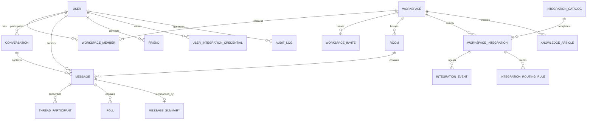

# 🗄️ Database Architecture & Data Modeling Specification (Phase 2)

This document provides the exhaustive specification of the **MongoDB Schema Architecture** designed for high throughput, sub-millisecond querying, and seamless long-term coexistence / migration to relational stores (PostgreSQL) in V2.

---

## 🏛️ Entity Relationship Diagram (ERD)



---

## 📋 Step 2.1 — User Model (`User.js`)

The `User` schema is segmented into 7 distinct conceptual modules:

```javascript
{
  // 1. Identity
  email: { type: String, required: true, unique: true, lowercase: true, index: true },
  username: { type: String, sparse: true, index: true },
  displayName: { type: String, required: true, trim: true },

  // 2. Authentication
  password: { type: String, select: false },
  passwordHashAlgo: { type: String, enum: ['argon2id', 'bcrypt'], default: 'argon2id' },
  isEmailVerified: { type: Boolean, default: false },
  emailVerificationToken: { type: String, select: false },
  emailVerificationExpires: { type: Date, select: false },
  resetPasswordToken: { type: String, select: false },
  resetPasswordExpires: { type: Date, select: false },

  // 3. Profile
  avatar: { type: String, default: null },
  bio: { type: String, maxlength: 250 },
  customStatus: {
    text: { type: String, maxlength: 100 },
    emoji: { type: String },
    expiresAt: { type: Date }
  },

  // 4. Status
  status: { type: String, enum: ['online', 'offline', 'away', 'dnd'], default: 'offline' },
  lastSeen: { type: Date, default: Date.now },

  // 5. Preferences
  preferences: {
    theme: { type: String, enum: ['light', 'dark', 'system'], default: 'dark' },
    notificationsEnabled: { type: Boolean, default: true },
    soundEnabled: { type: Boolean, default: true }
  },

  // 6. Security Metadata
  twoFactorEnabled: { type: Boolean, default: false },
  twoFactorSecret: { type: String, select: false },
  twoFactorBackupCodes: [{ type: String, select: false }],
  passkeyCredentials: [{
    id: String,
    publicKey: String,
    counter: Number,
    transports: [String]
  }],
  refreshTokens: [{ type: String, select: false }],

  // 7. Timestamps
  createdAt: { type: Date, default: Date.now },
  updatedAt: { type: Date, default: Date.now }
}
```

---

## 🏢 Step 2.2 — Workspace Model & Memberships

### 1. `Workspace.js`
- `name`: Workspace display name.
- `slug`: Unique URL identifier.
- `owner`: Reference `ObjectId -> User`.
- `settings`: Notification defaults, retention rules, allowed auth domains.

### 2. `WorkspaceMember.js`
- `workspace`: Reference `ObjectId -> Workspace` (Compound Indexed).
- `user`: Reference `ObjectId -> User` (Compound Indexed).
- `role`: **`owner` | `admin` | `moderator` | `member` | `guest`**.
- `permissions`: Custom granular permission override array (`['room.create', 'integration.manage']`).
- `joinedAt`: Date joined.

### 3. `WorkspaceInvite.js`
- `workspace`: Reference `ObjectId -> Workspace`.
- `email`: Target invitee email (optional for public links).
- `token`: Cryptographic unique invite hash.
- `role`: Role assigned upon joining (default: `'member'`).
- `expiresAt`: Expiration timestamp.
- `maxUses` / `usesCount`: Usage quota limits.

---

## 💬 Step 2.3 — Conversation Architecture

The chat domain strictly differentiates 4 conversation typologies:

```
┌────────────────────────────────────────────────────────────────────────┐
│                        CONVERSATION TYPES                              │
├───────────────────┬────────────────────────────────────────────────────┤
│ 1. DM             │ 1-on-1 direct message between two users            │
│ 2. GROUP_DM       │ Ad-hoc multi-user private direct conversation      │
│ 3. CHANNEL (ROOM) │ Workspace-scoped persistent text/voice/video room  │
│ 4. THREAD         │ Scoped reply stream anchored to a parent message   │
└───────────────────┴────────────────────────────────────────────────────┘
```

### Models:
1. **`Conversation.js`**:
   - `type`: `'direct'` | `'group'`.
   - `participants`: `[ObjectId -> User]`.
   - `lastMessage`: Reference `ObjectId -> Message`.
   - `updatedAt`: Compound indexed for active chat sorting.
2. **`Room.js`**:
   - `workspace`: Reference `ObjectId -> Workspace`.
   - `name`: Channel slug (e.g. `'general'`, `'engineering'`).
   - `type`: `'text'` | `'audio'` | `'video'`.
   - `isPrivate`: Access control flag.
   - `members`: Allowed member ID array for private rooms.
3. **`Message.js`**:
   - `conversationId`: Reference `ObjectId -> Conversation` (Optional).
   - `roomId`: Reference `ObjectId -> Room` (Optional).
   - `sender`: Reference `ObjectId -> User`.
   - `senderType`: `'USER'` | `'INTEGRATION'` | `'SYSTEM'`.
   - `content` / `encryptedContent`: Text payload.
   - `attachments`: Array of file metadata objects.
   - `reactions`: Array of `{ emoji, users: [ObjectId -> User] }`.
   - `threadParent`: Reference `ObjectId -> Message` (Null for top-level messages).
   - `replyCount`: Counter cache of thread replies.
   - `isPinned`: Boolean flag.
   - `isEdited`: Boolean flag + `editedAt`.
   - `isDeleted`: Soft deletion flag.
4. **`ThreadParticipant.js`**:
   - `parentMessage`: Reference `ObjectId -> Message`.
   - `user`: Reference `ObjectId -> User`.
   - `lastReadAt`: Unread thread counter tracker.
5. **`MessageSummary.js`**:
   - `targetId`: Reference to `Message` (Thread) or `Room` (Channel slice).
   - `summary`: AI-generated concise overview.
   - `actionItems`: Extracted action bullets.

---

## 🛠️ Step 2.4 — Supporting Models

- **`Reaction`**: Embedded sub-document within `Message` for low overhead and atomic `$addToSet` / `$pull` operations.
- **`Poll.js`**: `question`, `options: [{ text, votes: [UserId] }]`, `isMultiSelect`, `isClosed`, `expiresAt`.
- **`ScheduledMessage.js`**: `workspaceId`, `targetType` (`'room'` | `'conversation'`), `targetId`, `sender`, `content`, `scheduledFor`, `status` (`'pending'` | `'sent'` | `'cancelled'`).
- **`File.js`**: `filename`, `mimeType`, `sizeBytes`, `url`, `storageProvider` (`'local'` | `'cloudinary'` | `'s3'`), `uploadedBy`.
- **`Notification.js`**: `recipient`, `sender`, `type` (`'mention'`, `'reaction'`, `'invite'`, `'call'`), `resourceId`, `isRead`.
- **`Friend.js`**: `requester`, `recipient`, `status` (`'pending'` | `'accepted'` | `'blocked'`).

---

## 🛡️ Step 2.5 — Security & Compliance Models

- **`AuditLog.js`**: Records immutable security events (`userId`, `action`, `ipAddress`, `userAgent`, `metadata`, `success`, `timestamp`).
- **`ComplianceLog.js`**: Tracks GDPR deletion receipts, data export archives, and retention policy executions.

---

## 🔌 Step 2.6 — Integrations Models

- **`IntegrationCatalog.js`**: Available connector specifications (`id`, `name`, `category`, `authType`, `eventTypes`).
- **`WorkspaceIntegration.js`**: Workspace instance configuration (`workspaceId`, `integrationKey`, `status`, `config`).
- **`IntegrationEvent.js`**: Ingested webhook event payloads with **`idempotencyKey`** to prevent duplicate delivery.
- **`IntegrationRoutingRule.js`**: Rules directing incoming webhook events to designated channels (`repository`, `eventType`, `targetChannelId`).
- **`UserIntegrationCredential.js`**: AES-256-GCM encrypted OAuth tokens & API keys.
- **`ChannelEmailAddress.js`**: Dedicated inbound email bridge addresses linked to rooms.

---

## 🧠 Step 2.7 — AI Models

- **`KnowledgeArticle.js`**: Workspace knowledge documents with vector embedding pointers.
- **`KnowledgeQuota.js`**: Per-workspace AI token consumption tracking.
- **`SearchQuery.js`**: Semantic query history and latency metrics.
- **`ActionItem.js`**: AI-extracted tasks (`task`, `assignee`, `sourceMessageId`, `status`).
- **`Transcript.js`**: Real-time meeting audio speech-to-text streams.
