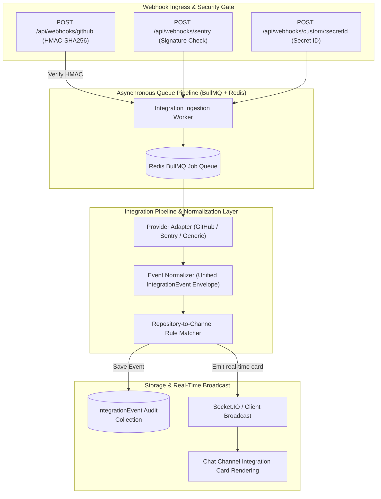

# Enterprise Integration Platform Architecture & Information

This document details the architecture, data models, worker pipeline, provider adapters, and security specifications for the **Enterprise Integration Platform** in **Private Pulse Platform**.

---

## 1. Enterprise Integration Architecture



---

## 2. Core Components & Subsystems

### 2.1. Provider Adapters (`server/src/integrations/adapters/`)
* **GitHub Adapter (`github.adapter.js`)**:
  - Ingests events: `pull_request`, `issues`, `push`, `pull_request_review`, `deployment_status`, `release`.
  - Verifies incoming payloads using `X-Hub-Signature-256` HMAC comparison.
  - Normalizes raw payloads into standard metadata (`actor`, `repo`, `branch`, `commitCount`, `actionUrl`, `diffStat`).
  - Supports outbound provider actions: `/api/integrations/actions` (`approve_pr`, `merge_pr`, `close_issue`, `add_comment`).
* **Sentry Adapter (`sentry.adapter.js`)**:
  - Ingests crash reports, issue creation, and error spikes.
  - Formats stack trace highlights, affected user counts, and error levels (fatal, error, warning).
* **Generic / Custom Webhook Adapter (`generic.adapter.js`)**:
  - Allows CI/CD systems (Jenkins, GitLab CI, GitHub Actions, Docker, custom cron scripts) to post arbitrary events to channels using secure 64-character token URLs.

### 2.2. Webhook Ingestion & Security
1. **HMAC SHA-256 Signature Verification**: Raw request buffers (`req.rawBody`) are validated against provider secrets to reject forged webhook attempts.
2. **AES-256-GCM Credential Storage**: User API tokens, OAuth refresh tokens, and webhook secrets are stored with authenticated AES-256-GCM encryption with distinct initialization vectors (IV) and auth tags.
3. **Secret ID Rotation**: Custom webhooks support instant zero-downtime secret ID rotation (`POST /api/integrations/custom-webhooks/:id/rotate`).

### 2.3. Event Normalization & Data Schema
Every provider event is normalized into an immutable **`IntegrationEvent`**:

```json
{
  "_id": "65fc2a9b71e2c84d",
  "workspaceId": "65fc18a2e4b0c10a",
  "channelId": "65fc19b3e4b0c10b",
  "provider": "github",
  "eventType": "pull_request.opened",
  "title": "[#42] Add WebAuthn biometric passkey support",
  "summary": "Himanshu opened PR #42 in Himanshu0523/pulse-chat (main <- feature/passkeys)",
  "actor": {
    "name": "Himanshu",
    "avatarUrl": "https://avatars.githubusercontent.com/u/123456",
    "url": "https://github.com/Himanshu0523"
  },
  "metadata": {
    "repository": "Himanshu0523/pulse-chat",
    "branch": "feature/passkeys",
    "additions": 412,
    "deletions": 18
  },
  "status": "success",
  "createdAt": "2026-09-11T12:00:00.000Z"
}
```

### 2.4. Smart Event Routing Engine
- Workspace administrators can configure granular routing rules (`IntegrationRoutingRule`):
  - **Match by Repository**: e.g., `Himanshu0523/backend-core` $\rightarrow$ `#backend-alerts`
  - **Match by Event Type**: e.g., `deployment_status.failed` $\rightarrow$ `#critical-incidents`
  - **Match by Branch**: e.g., `main` $\rightarrow$ `#production-releases`
- Events matching the rules are delivered directly to the designated channel without manual intervention.

---

## 3. Integration Endpoints Reference

| Endpoint | Method | Purpose |
| :--- | :---: | :--- |
| `/api/integrations/catalog` | `GET` | Browse all available catalog integrations |
| `/api/integrations/workspace` | `GET / POST` | Query or connect integrations to workspace |
| `/api/integrations/routing` | `GET / POST / PUT` | Manage repository-to-channel routing rules |
| `/api/integrations/custom-webhooks` | `POST` | Generate incoming webhook URL with secretId |
| `/api/integrations/actions` | `POST` | Trigger bidirectional actions (e.g., merge PR, close issue) |
| `/api/webhooks/github` | `POST` | Inbound GitHub webhook listener |
| `/api/webhooks/sentry` | `POST` | Inbound Sentry error alerting listener |
| `/api/webhooks/custom/:secretId` | `POST` | Generic incoming webhook listener |
