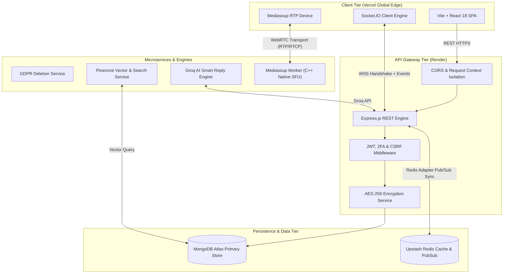

# Private Pulse Platform — Deep Dive System Architecture

This document provides an in-depth technical analysis of the system architecture, domain boundaries, design decisions, security engineering, and performance trade-offs in **Private Pulse Platform**.

---

## 🏛️ Phase 0: Architecture Foundation & Domain Boundaries

### 0.1 Frozen V1 Scope
The product scope for V1 is frozen across Authentication, Workspaces, Chat, Real-Time Communication, Files, Notifications, Integrations, AI Assistant, and Security. For the complete itemized matrix, see [DOMAIN_BOUNDARIES.md](file:///d:/Mini_Full_stack_App/CodeAlpha-fullstack-assesment/Pulse-chat-app/docs/DOMAIN_BOUNDARIES.md).

### 0.2 Domain Ownership Model
```
Auth Domain          -> User Identity, TOTP 2FA, JWT Tokens, Verification
Workspace Domain     -> Workspaces, Members, RBAC Roles, Invitations
Chat Domain          -> Conversations, Rooms, Messages, Threads, Reactions, Polls
Communication Domain -> Presence, Typing, WebRTC Signaling, Mediasoup SFU, Whiteboard
Files Domain         -> Upload / Download pipelines, S3/Cloudinary/Local storage adapters
Notification Domain  -> Notification lifecycle, badges, unread tracking
Integrations Domain  -> Catalog, Credentials, Inbound Webhooks, Email Bridge, GitHub/Sentry
AI Domain            -> Knowledge base, Semantic Vector Search, Groq Summaries & Smart Replies
Security Domain      -> Audit Logs, GDPR Compliance, AES-256 Encryption
```

---

## 🛠️ Phase 1: Repository & Development Infrastructure

### 1.1 Repository Structure & Git Workflow
- Directory structure: `client/`, `server/`, `docs/`, `scripts/`, `tests/` (See [FOLDER_STRUCTURE.md](file:///d:/Mini_Full_stack_App/CodeAlpha-fullstack-assesment/Pulse-chat-app/docs/FOLDER_STRUCTURE.md)).
- Branch taxonomy: `main`, `develop`, `feature/*`, `fix/*`, `release/*` (See [GIT_WORKFLOW.md](file:///d:/Mini_Full_stack_App/CodeAlpha-fullstack-assesment/Pulse-chat-app/docs/GIT_WORKFLOW.md)).

### 1.2 Categorized Environment Configuration
All configurations follow strict domain categorizations:
- `DATABASE`: MongoDB Connection & replication settings
- `REDIS`: Cache, pub/sub adapter, and BullMQ worker queue broker
- `JWT`: Token secrets, expiration windows, and bcrypt salt factors
- `SOCKET`: Port configurations, CORS origins, and heartbeat intervals
- `MEDIASOUP`: SFU listen IPs, announced IPs, and RTC port ranges
- `STORAGE`: Local upload directory, Cloudinary, and S3 credentials
- `EMAIL`: SMTP credentials, ports, and default sender addresses
- `AI`: Groq and Pinecone API credentials
- `INTEGRATIONS`: GitHub OAuth client IDs, webhook signing secrets
- `SECURITY`: AES-256 encryption keys, rate limit thresholds
- `OBSERVABILITY`: Node environment mode, Winston/Morgan logging levels

### 1.3 Containerized Development Environment
Orchestrated via `docker-compose.yml`:
- **MongoDB**: Primary persistent data store
- **Redis**: In-memory cache & Socket.io pub/sub cluster
- **Backend**: Express REST API & Mediasoup SFU
- **Frontend**: Vite development SPA server
- *(V2 Extension Roadmap: Qdrant vector database, Meilisearch full-text search, NATS event bus, Prometheus & Grafana telemetry)*

---

## 🗄️ Phase 2: Database Architecture (MongoDB $\rightarrow$ PostgreSQL Coexistence)

Detailed schema modeling is documented in [DATABASE_DESIGN.md](file:///d:/Mini_Full_stack_App/CodeAlpha-fullstack-assesment/Pulse-chat-app/docs/DATABASE_DESIGN.md):
- **User Model**: Segmented into Identity, Authentication, Profile, Status, Preferences, Security Metadata, and Timestamps.
- **Workspace Model**: `Workspace`, `WorkspaceMember` (supporting `owner`, `admin`, `moderator`, `member`, `guest`), and `WorkspaceInvite`.
- **Conversation Typologies**: Cleanly separates `DM`, `GROUP_DM`, `CHANNEL (ROOM)`, and `THREAD`.
- **Supporting Schemas**: `Reaction` (embedded for atomic ops), `Poll`, `ScheduledMessage`, `File`, `Notification`, `Friend`.
- **Security & Compliance**: `AuditLog` and `ComplianceLog` for non-repudiation.
- **Integration Schemas**: `IntegrationCatalog`, `WorkspaceIntegration`, `IntegrationEvent` (idempotent), `IntegrationRoutingRule`, `UserIntegrationCredential` (AES-256 encrypted), `ChannelEmailAddress`.
- **AI Schemas**: `KnowledgeArticle`, `KnowledgeQuota`, `SearchQuery`, `ActionItem`, `Transcript`.

---

## 🔐 Phase 3: Authentication, Session Management & RBAC

Detailed authentication protocols and access controls are documented in [AUTHENTICATION_FLOW.md](file:///d:/Mini_Full_stack_App/CodeAlpha-fullstack-assesment/Pulse-chat-app/docs/AUTHENTICATION_FLOW.md):
- **Registration**: Strong schema validation, HaveIBeenPwned breach check, Argon2id hashing, email verification token dispatch.
- **Login & 2FA**: Account lockout defense (5 attempts/15min), transparent Bcrypt $\rightarrow$ Argon2id lazy migration, TOTP 2FA enforcement, device anomaly detection.
- **Password Recovery**: Expiring reset tokens with full session revocation on password change.
- **Session Management**: Short-lived Access Token (15m) + HttpOnly Refresh Token (7d) with Redis Token Family lineage and instant reuse anomaly revocation (`signOutEverywhere`).
- **Role-Based Access Control (RBAC)**: Strict hierarchy (`owner` > `admin` > `moderator` > `member` > `guest`) with granular permissions (`workspace.*`, `member.*`, `room.*`, `message.*`, `file.*`, `call.*`, `integration.*`, `knowledge.*`).
- **Tenant Isolation**: Mandatory resolution chain: `Authenticated User` $\rightarrow$ `Workspace Membership` $\rightarrow$ `Permission Check` $\rightarrow$ `Workspace-Scoped Resource Query`. Client claims are never trusted directly.

---

## ⚙️ Phase 4: Backend Core & Standard API Contract

Detailed API specifications are documented in [API_SPECIFICATION.md](file:///d:/Mini_Full_stack_App/CodeAlpha-fullstack-assesment/Pulse-chat-app/docs/API_SPECIFICATION.md):
- **Express Layer Separation**: `server.js` (process lifecycle) $\rightarrow$ `app.js` (Express middleware) $\rightarrow$ `routes/` $\rightarrow$ `controllers/` (envelope only) $\rightarrow$ `services/` (business logic) $\rightarrow$ `models/`.
- **Standardized Pipeline**: `Request` $\rightarrow$ `Auth` $\rightarrow$ `Validation` $\rightarrow$ `Authorization` $\rightarrow$ `Controller` $\rightarrow$ `Service` $\rightarrow$ `Database` $\rightarrow$ `Response Envelope`.
- **Standard Error Hierarchy**: Standardized 400, 401, 403, 404, 409, 422, 429, 500 status codes with structured error payloads.
- **Validation Matrix**: Schema validation across body, query, route params, headers, files, webhooks, and AI requests.

---

## 🏢 Phase 5: Workspace Collaboration System

- **Workspace Hierarchy**: `User` $\rightarrow$ `Workspace` $\rightarrow$ `Members` $\rightarrow$ `Rooms` $\rightarrow$ `Messages`.
- **Workspace Operations**: Create, retrieve, update settings, archive (read-only mode), and cascade delete.
- **Member Governance**: Token-based invitations, role assignment (`owner`, `admin`, `moderator`, `member`, `guest`), removals, and custom permission overrides.
- **Rooms & Channels**: Public/private text, audio, and video channels with scoped member access.

---

## 💬 Phase 6: Chat Subsystem & Pagination

- **Conversation Lifecycle**: 1:1 Direct Messages, multi-user Group DMs, persistent Workspace Channels, and Threaded reply streams.
- **Message Lifecycle**: Sending, real-time receipt, editing (`isEdited: true`), soft deletion (`isDeleted: true`), emoji reactions, forwarding, and pins.
- **Message Metadata**: Sender, conversation ID, workspace ID, replyTo, attachments, mentions, reactions, and timestamps.
- **Cursor-Based Pagination**: High-performance streaming pagination via `before`, `after`, `cursor`, and `limit` over compound index `{ roomId: 1, _id: -1 }`.

---

## 📡 Phase 7: Real-Time Socket.IO Protocol

- **`noun.action` Event Taxonomy**: `message.created`, `message.updated`, `message.deleted`, `user.online`, `user.offline`, `presence.updated`, `typing.started`, `typing.stopped`, `reaction.added`, `reaction.removed`.
- **Socket & Room Authorization**: Every socket connection and room join (`workspace:<id>`, `room:<id>`, `conversation:<id>`) is explicitly verified against database memberships.

---

## ⚡ Phase 8: Ephemeral State & Redis Caching

- **Redis Roles**: Presence tracking, typing indicator broadcasting, session token families, sliding-window rate limiting, and distributed locks.
- **Presence**: Real-time `online`, `offline`, `away`, `busy` tracked in Redis hashes (`presence:<userId>`) with 30s heartbeats.
- **Typing**: 4-second TTL ephemeral keys in Redis with zero persistence in MongoDB.
- **Rate Limiting**: Sliding-window rate limiters protecting logins, registration, message dispatch, file uploads, and webhook endpoints.

---

## 📁 Phase 9: Files & Storage Subsystem

- **Storage Abstraction (`StorageService`)**: Decouples business logic from filesystem drivers (`upload`, `download`, `delete`, `getMetadata`), enabling seamless migration from local filesystem to S3-compatible object stores (MinIO, AWS S3, Cloudinary).
- **Validation Pipeline**: File size ceiling (10MB), MIME type verification against magic bytes, extension whitelisting, malicious filename sanitization, and strict workspace authorization scoping.

---

## 🔔 Phase 10: Notification Engine

- **Notification Service (`NotificationService`)**: Centralizes dispatch for message mentions (`@user`, `@channel`), friend requests, workspace invites, inbound calls, integration alerts, and AI action items.
- **Lifecycle States**: `created` $\rightarrow$ `delivered` $\rightarrow$ `read` $\rightarrow$ `archived`.
- **In-App & Email Bridge**: In-app notifications deliver via Socket.IO real-time events; asynchronous email notifications are queued via BullMQ worker.

---

## 👥 Phase 11: Friends & Social Graph

- **Relationship Matrix**: `send_request`, `accept`, `reject`, `cancel`, `remove_friend`, `block_user`, `list_friends`.
- **System Integration**: Integrates directly with 1:1 DM initialization, presence state broadcasting, and direct mention notifications.

---

## 📹 Phase 12: Audio/Video Calls (WebRTC & Mediasoup SFU)

- **Signaling Pipeline**: `Client` $\rightarrow$ `Socket.io Signaling` $\rightarrow$ `CallService` $\rightarrow$ `Mediasoup Worker` $\rightarrow$ `WebRTC SFU Transport`.
- **Media Controls**: Microphone mute/unmute, Camera enable/disable, Screen capture & publishing.
- **Multi-User Scalability**: Benchmarked for 2, 4, 8, and 16 concurrent streams per room without client uplink saturation.
- **QoE Telemetry**: Real-time monitoring of packet loss, round-trip time (RTT), jitter, bitrate, framerate, resolution, and ICE connection state.

---

## 🎨 Phase 13: Collaborative Whiteboard

- **Canvas Stream Pipeline**: `Whiteboard Client` $\rightarrow$ `Socket Handlers` $\rightarrow$ `Whiteboard Service` $\rightarrow$ `Room In-Memory Cache`.
- **Tool Suite**: Freehand drawing, text annotations, geometric shapes, element selection, erase, undo, redo, and room canvas clearing.
- **State Synchronization**: Real-time vector stroke diff streaming with full canvas snapshot caching on room joins.

---

## 🔍 Phase 14: Search V1 (Optimized MongoDB Indexing)

- **Structured & Text Search**: Targeted text indexes across `messages`, `users`, `rooms`, `files`, and `knowledge_articles`.
- **Compound Query Indexes**: Optimized compound indexes for filter combinations (`senderId`, `dateRanges`, `attachments`, `tags`).

---

## 🔌 Phase 15: Enterprise Integration Framework

- **Modular Architecture**: `External Webhook` $\rightarrow$ `Ingress Gate` $\rightarrow$ `Provider Adapter` $\rightarrow$ `IntegrationEvent (Idempotent)` $\rightarrow$ `Routing Engine` $\rightarrow$ `Channel Message Action`.
- **Credential Service (`CredentialService`)**: AES-256-GCM encrypted OAuth tokens, API keys, and webhook signing secrets.
- **Connectors**: Native GitHub (PRs, issues, commits, actions), Sentry (error alerts), Inbound Email Bridge, and Generic Webhooks.

---

## 🤖 Phase 16: AI Foundation & Gateway

- **AI Gateway Abstraction**: Unified internal interface decoupling application business logic from specific model providers (Groq Llama-3, OpenAI).
- **Core Capabilities**: Context-aware chat assistant, conversation summarization, smart 3-option replies, meeting transcripts, and action-item extraction.
- **AI Safety Controls**: Prompt boundary enforcement, input/output sanitization, strict tenant-isolated vector retrieval, and token usage rate limiting.

---

## 📚 Phase 17: Knowledge Base & RAG V1

- **RAG Data Pipeline**: `Document Upload` $\rightarrow$ `Text Parsing` $\rightarrow$ `Sanitization` $\rightarrow$ `Chunking` $\rightarrow$ `Vector Embedding` $\rightarrow$ `Vector Store (Qdrant / Pinecone)` $\rightarrow$ `Context Retrieval` $\rightarrow$ `LLM Generation` $\rightarrow$ `Grounded Answer`.
- **Quota Management (`KnowledgeQuota`)**: Per-workspace AI token limits and article document caps.

---

## 📝 Phase 18: Asynchronous Message Summaries

- **Worker Pipeline**: `Conversation Paging` $\rightarrow$ `BullMQ Summary Job` $\rightarrow$ `Groq Llama-3 Worker` $\rightarrow$ `MessageSummary Document` $\rightarrow$ `Socket Broadcast`.
- **Non-Blocking Architecture**: Summaries are processed completely asynchronously to guarantee zero HTTP/WebSocket latency overhead.

---

## 📋 Phase 19: AI-Driven Action Items

- **Extraction Pipeline**: `Meeting / Conversation Slice` $\rightarrow$ `AI Extractor` $\rightarrow$ `ActionItem Model` (`task`, `assignee`, `deadline`, `priority`, `sourceMessage`, `status`) $\rightarrow$ `Notification Dispatch`.

---

## 🛡️ Phase 20: Comprehensive Security Hardening

- **HTTP & Transport Security**: Helmet security headers, strict CORS origins, request body byte limits, CSRF protection.
- **Authentication Security**: Argon2id hashing, short-lived access JWTs (15m), HttpOnly refresh cookies (7d) with Redis token family rotation and instant reuse anomaly purging.
- **Authorization & Tenant Isolation Audit**: Strict enforcement of `workspace_id` scoping on every database query, ensuring zero cross-tenant leakage.
- **File & Media Security**: Magic byte verification, MIME validation, anti-path traversal filename sanitization.
- **AI & Data Privacy**: Prompt injection protection, data redaction, zero model training on customer messages, and Article 20 GDPR data export/deletion.

---

## 🌐 2. End-to-End System Architecture



---

## 🎥 3. WebRTC Media Architecture: Selective Forwarding Unit (SFU)

### The Challenge
Pure Peer-to-Peer (Mesh) WebRTC requires $N \times (N-1)$ connections. In a group call with 6 participants, each client must encode and transmit 5 video streams, saturating client uplink bandwidth and CPU.

### The Solution: Mediasoup SFU
- **Producers**: Each client sends exactly **1 video stream** and **1 audio stream** to the SFU worker.
- **Consumers**: The SFU forwards incoming RTP streams to all other connected participants without re-encoding, reducing CPU overhead to near zero.

---

## 🔍 4. Vector Search & AI Architecture

1. **Embedding Generation (`embedding.service.js`)**: Converts chat text into normalized vector representations. Supports OpenAI `text-embedding-3-small` and lightweight local vector hashing fallback.
2. **Pinecone Vector Search (`vector-search.service.js`)**: Performs vector indexing and cosine-similarity queries over indexed messages.
3. **Advanced 7-Filter Engine (`advanced-search.service.js`)**: Combines vector text matching with MongoDB structured filters (sender, date ranges, attachments, media types, URLs, domain filters, and user mentions).
4. **Groq AI Smart Replies (`smartReplies.service.js`)**: Extracts recent conversation history context and prompts Groq Llama-3 models to generate 3 concise, human-like reply suggestions.

---

## 🛡️ 5. Compliance & Security Engineering

- **AES-256-CBC Field Encryption**: Sensitive attributes are transparently encrypted before database insertion and decrypted post-query via Mongoose hooks.
- **11-Step GDPR Cascade Deletion**: `user-deletion.service.js` removes all personal data, files, room memberships, call records, and notifications, generating an immutable audit log entry in `ComplianceLog`.
- **Data Portability (`dataExport.controller.js`)**: Article 20 compliant data export streaming JSON metadata and structured CSV files in a ZIP container.
- **Two-Factor Authentication (TOTP)**: Built using `speakeasy` and `qrcode`, issuing 8-digit backup codes and enforcing password-confirmation verification.

---

## 🚀 6. Full Evolution Lifecycle & V1 $\rightarrow$ V1.5 $\rightarrow$ V2 Roadmap (Phases 21–48)

For the complete 48-phase specification covering V1 stabilization, V1.5 modular contracts, Strangler Go Gateway migration, NATS JetStream, Qdrant/Meilisearch hybrid search, and the 46-step execution dependency checklist, refer to the master document:
👉 **[MIGRATION_ROADMAP_V1_V2.md](file:///d:/Mini_Full_stack_App/CodeAlpha-fullstack-assesment/Pulse-chat-app/docs/MIGRATION_ROADMAP_V1_V2.md)**

---

*Architected and maintained by Himanshu (`https://github.com/Himanshu0523`).*
