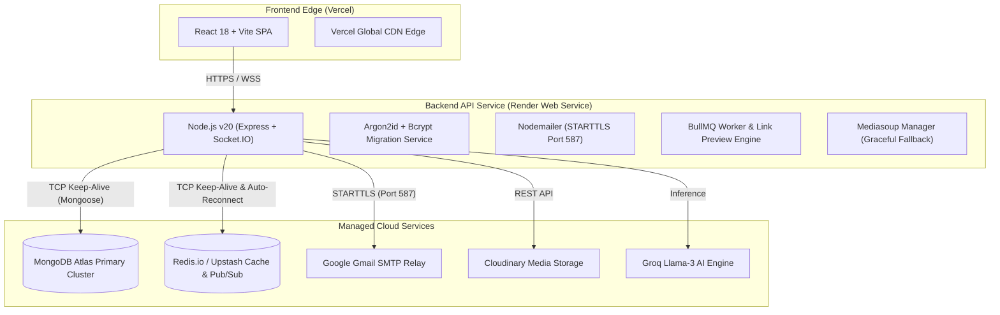

# Production Deployment & Infrastructure Knowledge Base

This guide documents the production deployment architecture, cloud configurations, network behaviors, and operational resolutions implemented for **Private Pulse Platform** across **Render (Backend)**, **Vercel (Frontend)**, **MongoDB Atlas**, **Redis Cloud**, and **Gmail SMTP**.

---

## 1. System Topology & Infrastructure Map



---

## 2. Environment Variable Master Specification

### Render Production Configuration

| Variable | Recommended Production Value | Description |
| :--- | :--- | :--- |
| `NODE_ENV` | `production` | Enables production optimizations & secure cookie policies |
| `PORT` | `10000` | Standard internal port binding for Render web services |
| `CLIENT_URL` | `https://private-pulse-platform.vercel.app` | Vercel production domain for CORS & Email Verification Links |
| `IMAGE_PROXY_BASE_URL`| `https://private-pulse-platform-backend.onrender.com/api/files/proxy-image?url=` | Proxied media delivery endpoint |
| `MONGO_URI` | `mongodb+srv://<user>:<password>@cluster.mongodb.net/<db>?retryWrites=true&w=majority` | Atlas SRV Connection URI |
| `JWT_ACCESS_SECRET` | `[64-character base64 secret]` | 256-bit secret for short-lived access tokens (15m) |
| `JWT_REFRESH_SECRET`| `[64-character base64 secret]` | 256-bit secret for long-lived refresh tokens (7d) |
| `REDIS_URL` | `redis://default:<password>@<host>:<port>` | Full connection URI for Redis cloud |
| `REDIS_HOST` | `<host>.db.redis.io` | Redis cluster hostname |
| `REDIS_PORT` | `<port>` | Redis custom TLS/TCP port |
| `REDIS_PASSWORD` | `<password>` | Redis authentication token |
| `SMTP_HOST` | `smtp.gmail.com` | Google SMTP server host |
| `SMTP_PORT` | `587` | **STARTTLS Port** (*Port 465 is blocked on Render*) |
| `SMTP_SECURE` | `false` | Required for STARTTLS (switches to TLS after handshake) |
| `SMTP_USER` | `user@gmail.com` | Authenticated Google account email |
| `SMTP_PASS` | `[16-character Google App Password]` | 2FA Google App Password (spaces removed) |
| `EMAIL_FROM` | `"Pulse Chat" <noreply@pulse.app>` | Header sender envelope address |
| `CLOUDINARY_CLOUD_NAME` | `<cloud_name>` | Cloudinary account identifier |
| `CLOUDINARY_API_KEY` | `<api_key>` | Cloudinary API Key |
| `CLOUDINARY_API_SECRET` | `<api_secret>` | Cloudinary API Secret |
| `GROQ_API_KEY` | `gsk_<api_key>` | Groq AI inference API key |

---

## 3. Production Issues Resolved & Engineering Resolutions

### 3.1. Authentication Failure on Deployed Instance (401 Unauthorized)
* **Problem:** Users registered locally could not log in on Render, throwing `401 Unauthorized`.
* **Root Cause:** In `server/package.json`, `render-build` ran with `--ignore-scripts`, skipping compilation of the C++ native addon `argon2`. When checking passwords hashed with Argon2id, `argon2.verify()` was unavailable and returned `false`.
* **Resolution:** 
  - Updated `render-build` script to execute `npm rebuild argon2`.
  - Configured `password.service.js` with dual-mode verification and transparent lazy migration from legacy bcrypt to Argon2id.

### 3.2. SMTP Delivery Failure (`ERR_CONNECTION_REFUSED` / Socket Drops)
* **Problem:** Outbound emails (verification links, 2FA alerts) failed to send on Render.
* **Root Cause:** Render blocks outbound TCP connections on SSL Port `465` by default across their container clusters.
* **Resolution:**
  - Migrated email dispatch to Port `587` using `STARTTLS` (`SMTP_PORT=587`, `SMTP_SECURE=false`).
  - Refactored `email.service.js` to avoid the hardcoded `service: 'gmail'` shorthand and strictly follow explicit host, port, and security parameters.

### 3.3. Runtime Crash (`ERR_REQUIRE_ESM` in `htmlparser2`)
* **Problem:** Server crashed immediately on boot with `Error [ERR_REQUIRE_ESM]: require() of ES Module htmlparser2...`.
* **Root Cause:** `sanitize-html@2.17.7` pulled `htmlparser2@^12.0.0` which dropped CommonJS `require()` support in favor of pure ESM.
* **Resolution:**
  - Pinned `sanitize-html` to version `2.13.1`.
  - Added npm `overrides` in `server/package.json`:
    ```json
    "overrides": {
      "htmlparser2": "9.1.0"
    }
    ```

### 3.4. Transient TCP Drops & Resets (`ECONNRESET`)
* **Problem:** Node process experienced unhandled socket read stream aborts (`ECONNRESET`) when MongoDB Atlas or cloud Redis terminated idle TCP connections.
* **Resolution:**
  - **MongoDB:** Added keep-alive heartbeats and IPv4 routing:
    ```js
    {
      socketTimeoutMS: 45000,
      serverSelectionTimeoutMS: 10000,
      heartbeatFrequencyMS: 10000,
      maxPoolSize: 10,
      minPoolSize: 2,
      maxIdleTimeMS: 30000,
      family: 4
    }
    ```
  - **Redis:** Configured `enableKeepAlive: true`, `reconnectOnError`, `commandTimeout: 15000`, and `connectTimeout: 20000`.
  - **Server Crash Guard:** Configured `unhandledRejection` and `uncaughtException` in `server.js` to log transient network disconnects without terminating the main process.

### 3.5. Duplicate Schema Index Warnings
* **Problem:** Mongoose logged `Duplicate schema index on {"addressHash":1} for model "ChannelEmailAddress"`.
* **Resolution:** Removed redundant `channelEmailAddressSchema.index({ addressHash: 1 })` call since `unique: true` already creates the required index.

---

## 4. Operational Best Practices & Maintenance

1. **Keep-Alives & Cold Starts:** Free/Starter Render instances sleep after 15 minutes of inactivity. Health check pings can be sent to `/api/health` to keep the container active.
2. **Reverse Proxy Configuration:** Always ensure `app.set('trust proxy', 1)` is enabled in Express so client IP addresses are correctly evaluated behind Render's Cloudflare/Ingress load balancers.
3. **Database Index Synchronization:** Run `npm run sync-indexes` on schema updates to ensure compound indexes are aligned.
